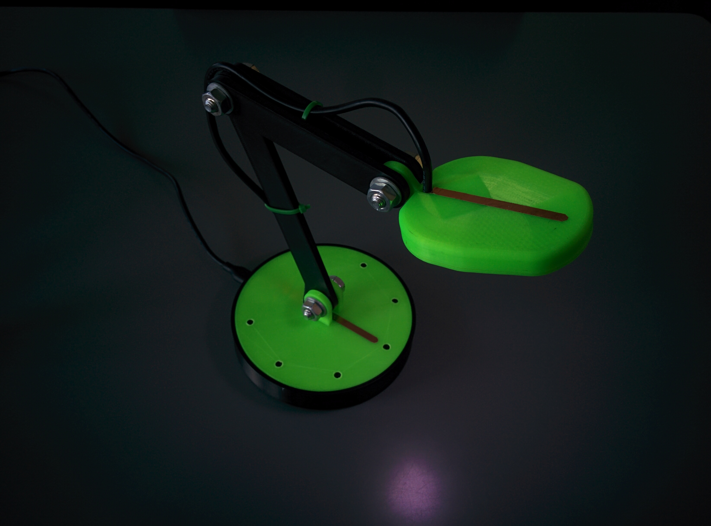
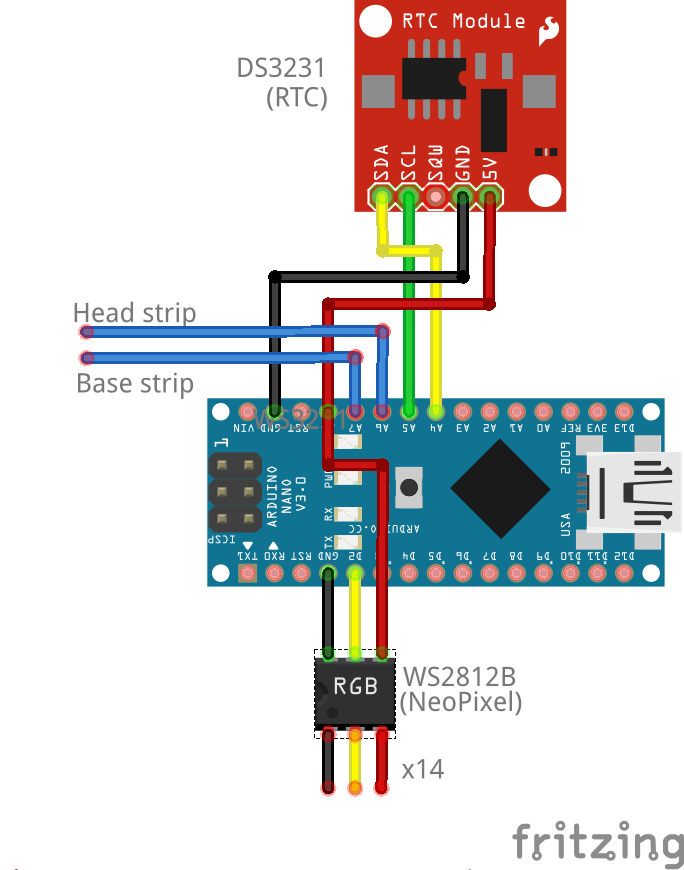

# Trilight  
_NeoPixel based lamp with dynamic colour temperature_

TriLight is a lamp which dynamically adjuss its colour temperature based on the time of day. By reducing the amount of blue light in the evening and night, melatonin suppression is avoided, which allows for better sleep at night.  

## BOM

Electrics and electronics:
+ 1x Arduino nano
+ 1x DS3238 RTC Module
+ 14x DS2812 (NeoPixel)
+ 15cm Copper tape
+ 30cm 4 wire cable (Ex. USB 2.0 cable)
+ A bit of solidcore wire (or multicore if you hate yourself)

Lamp:
+ 3 8mm nuts
+ 3 8mm bolts
+ 12 8mm washers

Tools:
+ 3D printer
+ Soldering iron

## Things to print:
+ 1x Base - Bottom
+ 1x Base - Top
+ 1x Arm  - 1
+ 2x Arm  - 2
+ 1x Head - Bottom  (v2)
+ 1x Head - Top     (v2)
Files can be found in /STL, or /Inventor if you wish to modify it.

## Circuit:  

## Steps:
1. Assemble lamp with washers between each plastic part
1. Solder DS2812's together (easier if not broken apart)
1. Mount tape and cable on lamp, solder together
1. Solder remaining parts and mount with hot glue
1. Add weights to base
1. Assemble lamp base (holes might need drilling)
1. Flash arduino software
1. Run configuration utility

